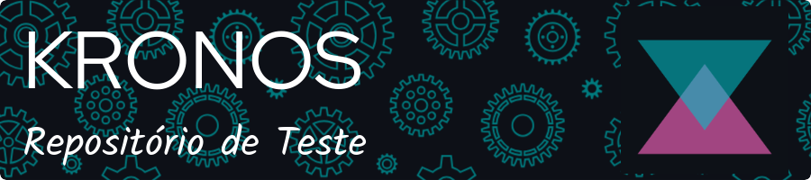

## Sobre Nós

Kronos é um sistema integrado de gestão de agendamentos e controle de estoque desenvolvido para atender às necessidades da área de estética e beleza. Nosso objetivo é proporcionar uma solução completa e eficiente para profissionais e empreendedores autônomos do setor, permitindo uma gestão simplificada de seus negócios.

## Funcionalidades Principais

- Gestão de agendamentos de clientes
- Controle de estoque de produtos utilizados nos serviços
- Páginas intuitivas para cadastro, login e perfil de clientes
- Integração com calendário para visualização de disponibilidade de horários
- Envio de confirmações e lembretes de consultas por e-mail ou SMS
- Sistema de feedback para clientes deixarem comentários e sugestões
- Páginas informativas sobre os serviços oferecidos e perguntas frequentes
- Painéis de controle com métricas de desempenho e insights do negócio

## Desenvolvimento feito em

## Como Contribuir

1. Faça um fork do repositório Kronos.
2. Crie uma branch para sua contribuição: `git checkout -b minha-contribuicao`.
3. Faça as alterações desejadas e adicione commits explicativos: `git commit -m "Adiciona funcionalidade X"`.
4. Faça push para a branch: `git push origin minha-contribuicao`.
5. Abra um pull request com uma descrição clara do que foi implementado.

## Contato

Para mais informações sobre o Kronos, entre em contato conosco:  

